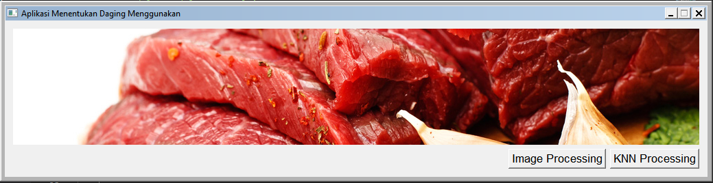
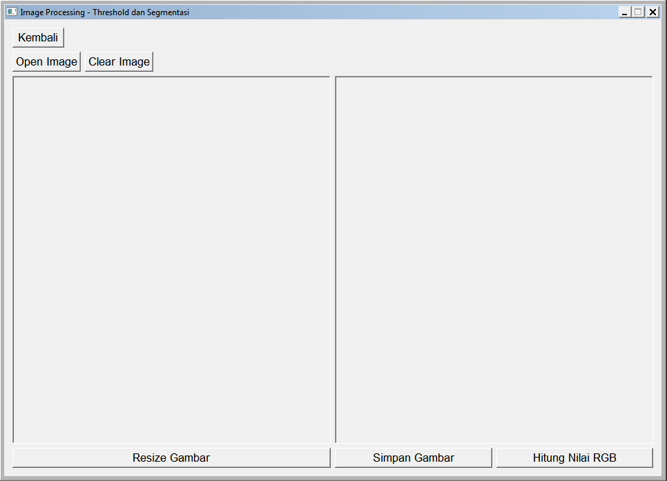
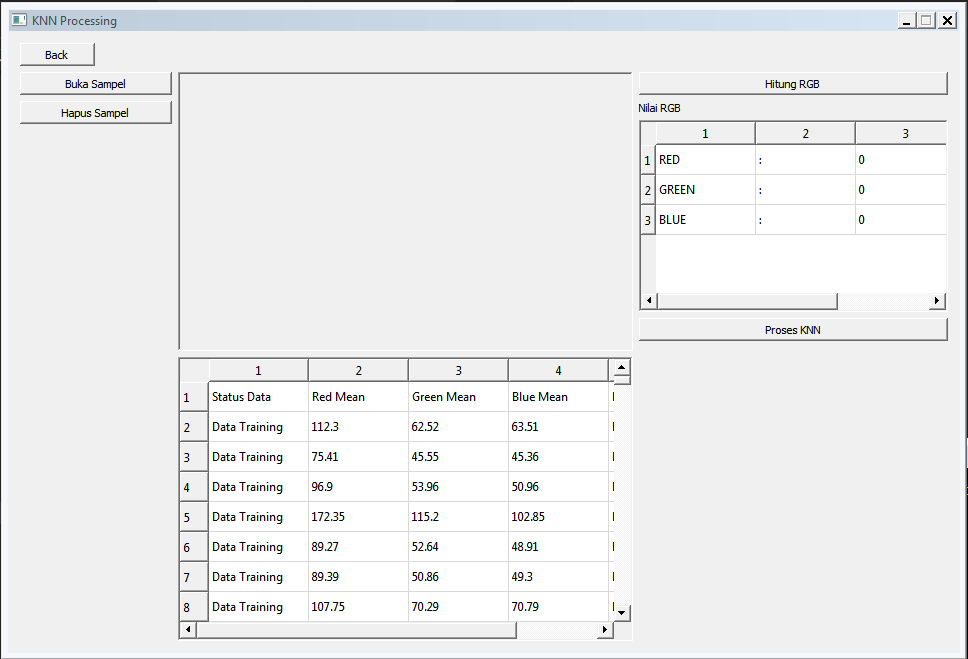

# KNN-Daging-Project

A Program determines the picture either beef or pork using KNN method.

## Tech Stacks

- Python
- OpenCV
- MySQL
- PyQt

## Screenshots

Main window of program

Image Processing

KNN Processing

## Date Launch

This project completed on December 2020
